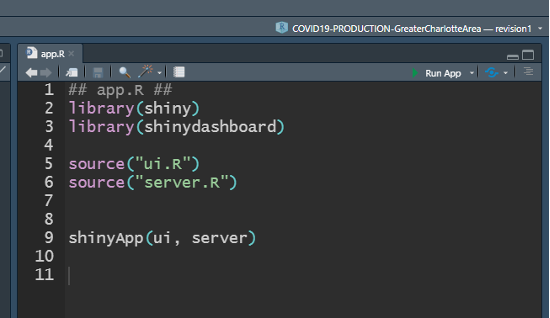
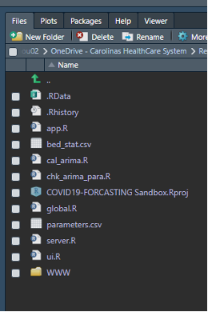
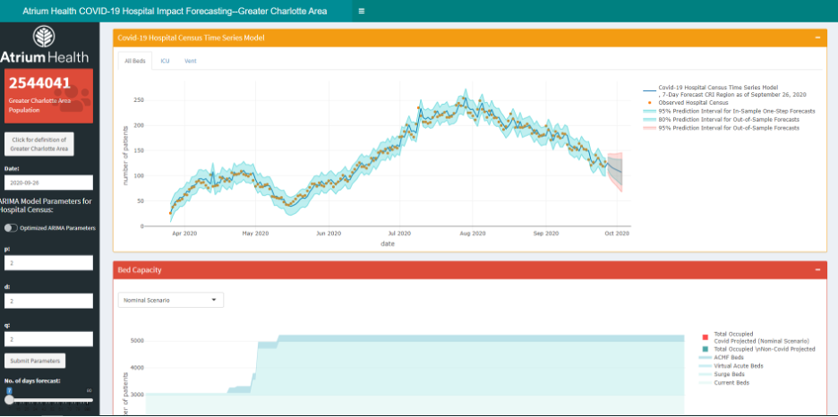
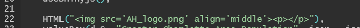

<h1 align="center">Implementation of an Adaptable COVID-19 Utilization and Resource Visualization Engine (CURVE) to Depict In-Hospital Resource Forecasts Over Time</h1>

# Overview

1.	Instructions for running the *CURVE* app in RStudio:

To run *CURVE*, we suggest using RStudio (https://www.rstudio.com/). After installing RStudio, double click the “COVID19-FORCASTING Sandbox.Rproj” file to open the app within the RStudio IDE. Once RStudio is open, click "app.R" file under the Files tab to open the file, and  hit Run App on the upper-right portion of the source window. The screenshots below should help guide this process. 




The R Shiny app will be displayed as the following figure.



Within *CURVE*, users can view the COVID-19 hospital, ICU, and ventilator censuses that are forecasted by the ARIMA model. The metaparameters for the ARIMA model can be manually adjusted by entering *p*, *d*, and *q*, or switching the toggle for **Optimized ARIMA Parameters** followed by clicking the **Submit Parameters** button. Note the later option uses the `auto.arima()` function provided by the `forecast` package 
([Hyndman, Athanasopoulos, Bergmeir, Caceres, Chhay, O'Hara-Wild, Petropoulos, Razbash, Wang, Yasmeen 2021; Hyndman and Khandakar 2008](#my-refs)). Users can also change the date or modify the number of days ahead in the forecast. All the charts will be adjusted accordingly. 

2.	Customizing *CURVE*:

  - Changing the logo: 
    
    Users can modify the logo by adding their own logo into the WWW folder. Currently, we have named our logo figure "AH_logo.png". Users can then change the name of the figure in the "ui.R" file (see the figure below).
    
    
  
  - Changing COVID-19 bed counts:

    All the bed counts are stored in the "bed_stat.csv" file, including the COVID-19 hospital census (named `all_bed`), ICU bed census (named `icu`), mechanical ventilator usage (named `vent`), and virtual hospital acute beds (named `virtual_acute`). If users don’t have virtual hospital bed counts, then they can put 0s in the `virtual_acute` column.
    
  - Changing bed capacity data:
  
    The bed capacity data are stored in the "parameters.csv" file. The 1st column (named `item`) stores the categories of the beds, including currently occupied non-COVID-19 beds (named `all`), additional unoccupied surge beds (named `surge`), unoccupied virtual hospital acute beds (named `virtual_acute`), unoccupied acute care medical facility beds (named `morecrot_bed`), and projected non-COVID-19 beds based on known hospital metrics (named `pred_non_covid`).
    
    The 2nd column contains total numbers of beds. For example, on 3/11/2020, we had 100 surge beds, followed by surge bed counts of 583, 1,744, and 2,000 on 4/21, 4/23, and 5/1/2020, respectively. Note the 3rd column, entitled `start_date`, contains the aforementioned dates.
    
    Users can also change the beds labels and colors (4th and 6th columns). Note that a bed category should have a consistent label and color. For example, all surge beds have the same label (`Surge Beds`) and color (`rgba(183, 236, 234, 0.5)`).  
    
    In the 5th column, a `stackgroup` value of `one` defines a group of bed types that is used by the area chart in the Bed Capacity section of *CURVE*. Projected non-COVID-19 beds were pooled with the COVID-19 hospital census and the forecast and assigned a `stackgroup` value of `two`. This group was displayed using a bar chart that was overlayed on the area chart. Thus, the user can quickly ascertain whether the total number of occupied beds will exceed the health system’s bed capacity. Users can add or remove a different category of bed to a group of bed types. 

To reference *CURVE*, please cite [the paper](https://www.medrxiv.org/content/10.1101/2020.05.01.20087973v1):
```c

@article{chou2020covid,
  title={COVID-19 Utilization and Resource Visualization Engine (CURVE) to Forecast In-Hospital Resources},
  author={Chou, Shih-Hsiung and Kearns, James T and Turk, Philip and Kowalkowski, Marc and Roberge, Jason and Priem, Jennifer S and Taylor, Yhenneko J and Burns, Ryan and Palmer, Pooja and McWilliams, Andrew D},
  journal={medRxiv},
  year={2020},
  publisher={Cold Spring Harbor Laboratory Press}
}
```

# <a id="my-refs"></a> References

- Hyndman R, Athanasopoulos G, Bergmeir C, Caceres G, Chhay L, O'Hara-Wild M,
Petropoulos F, Razbash S, Wang E, Yasmeen F (2021). _forecast: Forecasting functions
for time series and linear models_. R package version 8.14, <URL:
https://pkg.robjhyndman.com/forecast/>.
- Hyndman RJ, Khandakar Y (2008). “Automatic time series forecasting: the forecast
package for R.” _Journal of Statistical Software_, *26*(3), 1-22. <URL:
https://www.jstatsoft.org/article/view/v027i03>.


